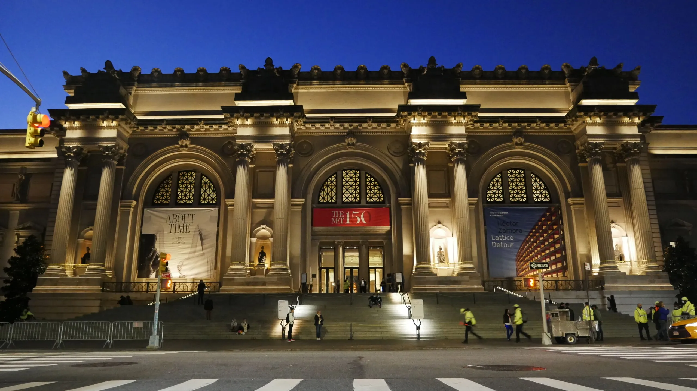
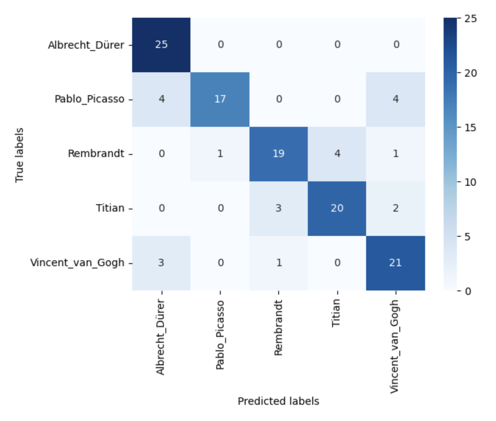

# Art Identifier

Author: A. Utku Kale

Repository Structure

├── data

├── .gitignore

├── Final_Notebook.ipynb

├── README.md

└── ArtIdentifier.pdf

Metropolitan Museum of Art


## Project Overwiev 

This machine learning project is focused on identifying the painter of a painting from an image and can be used to help with the authentication and verification of artwork. The Metropolitan Museum of Art can use this model to determine the authenticity of paintings attributed to the 5 artists: Van Gogh, Durer, Picasso, Titian, and Rembrandt. The model is trained using a dataset of paintings by the 5 artists and uses deep learning techniques to extract features from the images. By analyzing the unique style and characteristics of each artist's work, the model can compare a new painting to known works by the same artist and provide an expert opinion on its authenticity.

For example, let's say a collector or dealer approached the museum with a painting attributed to Titian. By using your artist identifier to analyze the painting's unique brushstrokes, color palette, and other characteristics, the museum could compare it to other known works by Titian that were created during the same time period. If the painting's style and characteristics align with those of Titian's other works, it would provide additional evidence for its authenticity. However, if the painting's style and characteristics do not align with those of Titian's other works, it could indicate that the painting is a forgery or imitation. In this case, the museum could provide an expert opinion on the painting's authenticity based on the analysis conducted using your artist identifier.

The project involves preprocessing the image data, model training, and evaluation using metrics such as accuracy. This project can be used to prevent the spread of forgeries and imitations, ensuring the integrity of the art market.


## Data

The dataset used for this machine learning project is a Best Artworks of All Time dataset obtained from Kaggle, 50 most-influential artists, 8400+ paintings in total.  
The data was scraped from artchallenge.ru during the end of February 2019.
https://www.kaggle.com/datasets/ikarus777/best-artworks-of-all-time

Below is the list of 50 artists.

Albrecht Dürer, Alfred Sisley, Amedeo Modigliani, Andrei Rublev, Andy Warhol, Camille Pissarro, Caravaggio, Claude Monet, Diego Rivera, Diego Velazquez, Edgar Degas, Edouard Manet, Edvard Munch, El Greco, Eugene Delacroix, Francisco Goya, Frida Kahlo, Georges Seurat, Giotto di Bondone, Gustav Klimt, Gustave Courbet, Henri Matisse, Henri Rousseau, Henri de Toulouse-Lautrec, Hieronymus Bosch, Jackson Pollock, Jan van Eyck, Joan Miro, Kazimir Malevich, Leonardo da Vinci, Marc Chagall, Michelangelo, Mikhail Vrubel, Pablo Picasso, Paul Cezanne, Paul Gauguin, Paul Klee, Peter Paul Rubens, Pierre-Auguste Renoir, Piet Mondrian, Pieter Bruegel, Raphael, Rembrandt, Rene Magritte, Salvador Dali, Sandro Botticelli, Titian, Vasiliy Kandinskiy, Vincent van Gogh, William Turner.

Art Identifier model aims to identify paintings for 5 artists below.

- Vincent Van Gogh
- Pablo Picasso
- Rembrandt
- Titian
- Albrecht Dürer


## Project steps
This machine learning project involved several key phases. Firstly, I conducted an exploratory data analysis phase to understand the distribution of the data. I then performed data augmentation and preprocessing of the image data by resizing the images, converting them to RGB, and normalizing pixel values. Next, I created baseline convolutional neural network models and more advanced models using transfer learning techniques, such as pre-trained models like VGG16 and VGG19. I evaluated the performance of these models on a hold-out test set and identified the best-performing model for rating prediction. The evaluation metric for this project is accuracy.

## Results

The initial accuracy of the baseline models was 0.66, and the best results were achieved using the VGG19 model with a transfer learning approach, achieving an accuracy of 0.81.




## Summary

In summary, this machine learning project utilizes deep learning techniques to identify the painter of a painting from an image. By training the model on a dataset of paintings by five prominent artists, the Metropolitan Museum of Art can use the model to verify the authenticity of paintings attributed to Van Gogh, Durer, Picasso, Titian, and Rembrandt.

The project involves preprocessing the image data, model training, and evaluation using metrics such as accuracy. By analyzing the unique style and characteristics of each artist's work, the model can compare a new painting to known works by the same artist and provide an expert opinion on its authenticity.

This project can be used to prevent the spread of forgeries and imitations in the art market, which helps to ensure its integrity. The dataset used for training the model is the "Best Artworks of All Time" dataset obtained from Kaggle, which contains over 8,400 paintings by 50 influential artists. The model is trained to identify paintings by five of these artists, namely Van Gogh, Durer, Picasso, Titian, and Rembrandt.

The project involves several key phases, including exploratory data analysis, data augmentation and preprocessing, model training, and evaluation. Baseline convolutional neural network models and more advanced models using transfer learning techniques were created, and the best-performing model was identified based on accuracy. Initial accuracy was 0.66 and best results achieved among 15 CNN models via Transfer Learning VGG19 model with accuracy of 0.81. Overall, this project has significant implications for the art market, and it provides a useful tool for museums, collectors, and dealers in verifying the authenticity of paintings.


```python
!jupyter nbconvert --execute --to markdown README.ipynb
```

    [NbConvertApp] Converting notebook README.ipynb to markdown
    [NbConvertApp] Writing 6061 bytes to README.md

